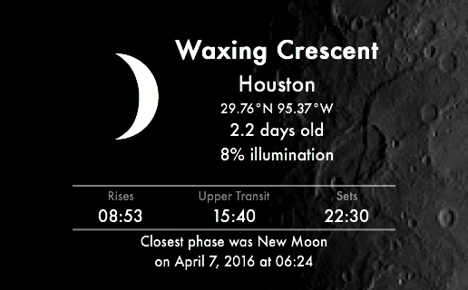

# Moon Phase
A widget for [Übersicht](http://tracesof.net/uebersicht/).  In beta.



Uses the following APIs
* [freegeoip.net](http://freegeoip.net)
  for location based on IP address (if no locale set).

* [Google Geocoding](https://developers.google.com/maps/documentation/geocoding/intro)
  for latitude and longitude based on location.

* [US Naval Observatory](http://www.usno.navy.mil/USNO/astronomical-applications)
  for moon phase information based on latitude, longitude, and local time zone.

## Locale and Options.
These can be set by editing the `index.coffee` file.

If locale is set, you save an API call based on your IP address.

    ```
    locale =
      city     : 'Cupertino'
      region   : 'CA'
      country  : 'USA'
    ```

The font, icon, and colour settings do what you'd expect.
* Fonts are scaled with respect to others to give the widget balance: change at your discretion.
* Colours have been tested with white text on dark-grey and black text on light-grey. Giving things a
splash of colour might be the perfect tweak for you.
* Two icon sets can be used: one where pixels represent the `lit` side of the moon, the other where
pixels represent the `shadow` side of the moon.

Any row of presented data can be disabled by setting their option to `false`. There is an additional
option (`showAMPM`) to use a 12-hour clock instead of the default 24-hour clock.

The top-down order of presented data can be changed by adjusting the order of the `div` elements in the
`render` function.

## Credits
Much inspiration was taken from Felix Hageloh's [Weather Widget](http://github.com/felixhageloh/weather-widget)

Icons by Erik Flowers (http://erikflowers.github.io/weather-icons/)

## License
[MIT LICENSE](https://github.com/joecreighton/moon-phase/blob/master/LICENSE)
