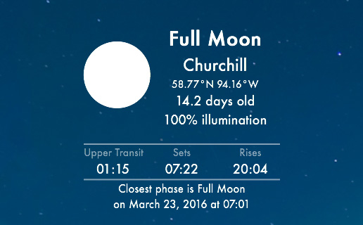
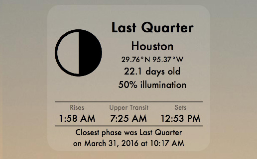

# Moon Phase
A widget for [Übersicht](http://tracesof.net/uebersicht/).  In beta.



Uses the following APIs
* [freegeoip.net](http://freegeoip.net)
  for location based on IP address (if no locale set).

* [Google Geocoding](https://developers.google.com/maps/documentation/geocoding/intro)
  for latitude and longitude based on location.

* [US Naval Observatory](http://www.usno.navy.mil/USNO/astronomical-applications)
  for moon phase information based on latitude, longitude, and local time zone.

## Locale and Options
These can be set by editing the `index.coffee` file.

The locale is empty by default and will do a lookup based on your IP or, save an API call and set it.

    ```
    locale =
      city     : 'Amsterdam'
      region   : 'Netherlands'
    ```

The font, icon, and colour settings do what you'd expect.
* Fonts are scaled with respect to others to give the widget balance: change at your discretion.
* All text is one colour, the header `Rises, Upper Transit, Sets` can use another.
* Two icon sets can be used: one where pixels represent the `lit` side of the moon, the other where
pixels represent the `shadow` side of the moon.
* There's an additional option (`showAMPM`) to use a 12-hour clock instead of a 24-hour clock.



* All but two data elements -- moon icon and phase name -- can be disabled by setting their option to
`false`.


## Credits
Much inspiration was taken from Felix Hageloh's [Weather Widget](http://github.com/felixhageloh/weather-widget)

Icons by Erik Flowers (http://erikflowers.github.io/weather-icons/)

## License
[MIT LICENSE](https://github.com/joecreighton/moon-phase/blob/master/LICENSE)
